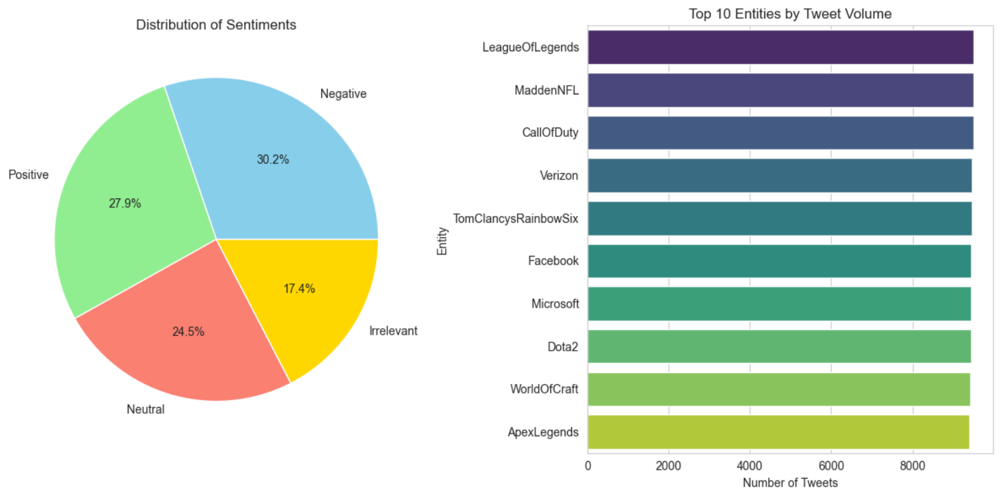

# Automated ETL Pipeline for Social Media Sentiment Analysis



This project is a complete, end-to-end ETL (Extract, Transform, Load) pipeline built with Python. It automatically extracts tweet data from a CSV file, cleans and transforms the data using Pandas, and loads it into a structured PostgreSQL database. The final stage involves querying the database and performing sentiment analysis to generate actionable insights, which are visualized with Matplotlib and Seaborn.

---

## Tech Stack

- **Language:** Python, SQL
- **Data Manipulation:** Pandas
- **Database:** PostgreSQL
- **Connectivity:** SQLAlchemy, psycopg2
- **Analysis & Visualization:** JupyterLab, Matplotlib, Seaborn
- **Version Control:** Git & GitHub

---

## Key Features

* **Automated ETL Process:** The core of the project is a Python script (`src/etl_pipeline.py`) that handles the entire data pipeline, making the process repeatable and efficient.
* **Optimized Database Schema:** The PostgreSQL database was designed with a clean schema (`sql/create_tables.sql`) to ensure data integrity and efficient querying.
* **Secure Credential Management:** Database passwords are kept secure and separate from code using a `.env` file, which is ignored by version control via `.gitignore`.
* **Insightful Data Visualization:** The analysis notebook (`analysis/twitter_analysis.ipynb`) queries the processed data to produce clear visualizations that reveal key trends in sentiment and topic volume.

---

## How to Run This Project Locally

1.  **Clone the repository:**
    ```bash
    git clone [https://github.com/Srimannarayana-ai/Social-Media-ETL-Pipeline.git](https://github.com/Srimannarayana-ai/Social-Media-ETL-Pipeline.git)
    cd Social-Media-ETL-Pipeline
    ```
2.  **Set up the environment:**
    - Ensure you have Python and PostgreSQL installed.
    - Create a Python virtual environment: `python -m venv venv`
    - Activate it: `.\venv\Scripts\activate`
    - Install dependencies: `pip install -r requirements.txt`
3.  **Database Setup:**
    - Create a PostgreSQL database named `social_media_db`.
    - Run the `sql/create_tables.sql` script to create the `tweets` table.
4.  **Set Environment Variables:**
    - Create a `.env` file in the root directory.
    - Add your database password to it: `DB_PASSWORD=your_password_here`
5.  **Run the ETL Pipeline:**
    ```bash
    python src/etl_pipeline.py
    ```
---

## Project Outcome

This project successfully demonstrates the entire lifecycle of a data analytics task. Key insights from the analysis include:
- **Negative sentiment (30.2%)** was the most prevalent category in the dataset, indicating a significant volume of critical discussion.
- **'League of Legends' and 'Madden NFL'** were the most discussed topics, highlighting their major online presence.
