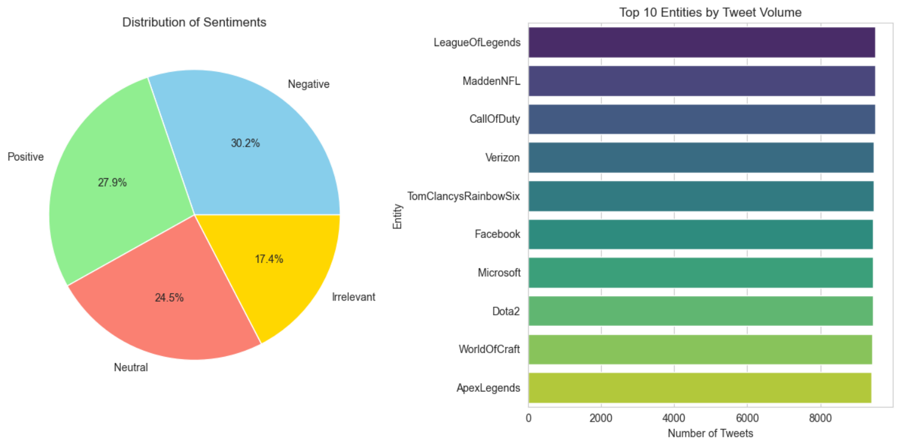

# Automated ETL Pipeline for Social Media Sentiment Analysis



This project is a complete, end-to-end ETL (Extract, Transform, Load) pipeline built with Python. It automatically extracts tweet data from a CSV file, cleans and transforms the data using Pandas, and loads it into a structured PostgreSQL database. The final stage involves querying the database and performing sentiment analysis to generate actionable insights, which are visualized with Matplotlib and Seaborn.

---

## Tech Stack

- **Language:** Python, SQL
- **Data Manipulation:** Pandas
- **Database:** PostgreSQL
- **Connectivity:** SQLAlchemy, psycopg2
- **Analysis & Visualization:** JupyterLab, Matplotlib, Seaborn
- **Version Control:** Git & GitHub

---

## Key Features

* **Automated ETL Process:** The core of the project is a Python script (`src/etl_pipeline.py`) that handles the entire data pipeline, making the process repeatable and efficient.
* **Optimized Database Schema:** The PostgreSQL database was designed with a clean schema (`sql/create_tables.sql`) to ensure data integrity and efficient querying.
* **Secure Credential Management:** Database passwords are kept secure and separate from code using a `.env` file, which is ignored by version control via `.gitignore`.
* **Insightful Data Visualization:** The analysis notebook (`analysis/twitter_analysis.ipynb`) queries the processed data to produce clear visualizations that reveal key trends in sentiment and topic volume.

---

## How to Run This Project Locally

The easiest way to run this project is using Docker. It will automatically set up the Postgres database and run the ETL script.

1.  **Clone the repository:**
    ```bash
    git clone https://github.com/Srimannarayana-ai/Social-Media-ETL-Pipeline.git
    cd Social-Media-ETL-Pipeline
    ```

2.  **Set Environment Variables:**
    - Create a `.env` file in the root directory.
    - Add these credentials to it:
      ```env
      DB_PASSWORD=SecurePassword123!
      POSTGRES_PASSWORD=SecurePassword123!
      ```

3.  **Run with Docker Compose:**
    ```bash
    docker-compose up --build -d
    ```
    This single command will:
    - Download and configure the PostgreSQL database.
    - Automatically create the required `tweets` tables.
    - Build a Python container and install all dependencies.
    - Run the ETL pipeline script.

4.  **Check the logs:**
    ```bash
    docker logs social_media_etl
    ```
    You should see success messages indicating the data has been extracted, transformed, and loaded into the database!
---

## Project Outcome

This project successfully demonstrates the entire lifecycle of a data analytics task. Key insights from the analysis include:
- **Negative sentiment (30.2%)** was the most prevalent category in the dataset, indicating a significant volume of critical discussion.
- **'League of Legends' and 'Madden NFL'** were the most discussed topics, highlighting their major online presence.
